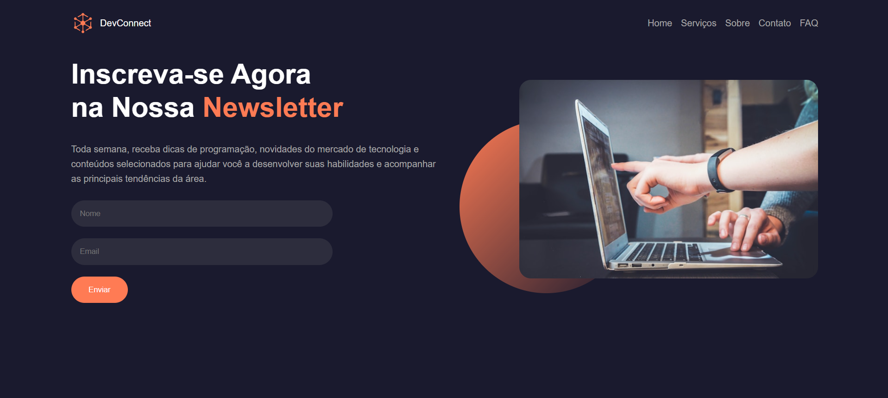

# DevConnect

Uma landing page responsiva para inscrição em uma newsletter voltada para programação e tecnologia.

## 🔗 Demonstração

🌐 [Acessar o DevConnect](https://devconnect-six-lyart.vercel.app/)

## 📷 Preview

<p align="center">
  
</p>

## 🚀 Tecnologias utilizadas

- HTML5
- CSS3
- Flexbox
- Media Queries

## ✨ Funcionalidades

- Layout moderno e responsivo
- Menu de navegação
- Formulário de inscrição
- Campos para nome e e-mail
- Botão de envio
- Design adaptado para dispositivos móveis
- Efeito visual com elipse e imagem de destaque

## 📱 Responsividade

O projeto foi desenvolvido para se adaptar a diferentes tamanhos de tela, incluindo computadores, tablets e dispositivos móveis.

## 📚 Aprendizados

Durante o desenvolvimento deste projeto foram praticados conceitos de:

- Estruturação de páginas com HTML
- Organização de elementos com Flexbox
- Estilização de formulários
- Posicionamento com `position: relative` e `position: absolute`
- Uso de `z-index`
- Pseudo-classes como `:hover`
- Responsividade com Media Queries
- Organização de arquivos em um projeto Front-end

## 📁 Estrutura do projeto

```text
devconnect/
│
├── img/
│   ├── logo.png
│   ├── banner.jpg
│   └── preview.png
│
├── index.html
├── style.css
└── README.md